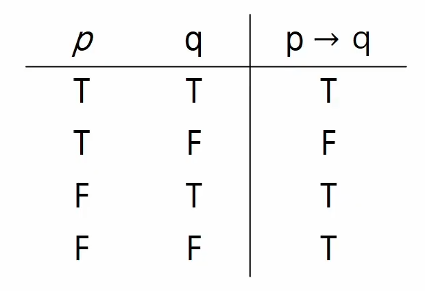

# ALGORITHM

- 좋은 알고리즘이란?
  - 정확성 : 얼마나 정확하게 동작하는가
  - 작업량 : 얼마나 적은 연산으로 원하는 결과를 얻어내는가
  - 메모리 사용량 : 얼마나 적은 메모리를 사용하는가
  - 단순성 : 얼마나 단순한가
  - 최적성 : 더 이상 개선할 여지없이 최적화되었는가
- __시간 복잡도__
  - 실제 걸리는 시간을 측정
  - 실행되는 명령문의 개수를 계산
  - __빅-오 표기법__
    - 시간 복잡도 함수 중에서 가장 큰 영향력을 주는 n에 대한 항만을 표시

---

### 자료구조

- 데이터를 효율적으로 저장하고 관리하기 위한 방법
  - 선형 자료구조
    - list
    - stack
    - queue
    - linked list
  - 비선형 자료구조
    - graph
    - tree
- ADT(추상화 데이터 타입)
  - 구조화된 데이터를 필요한 연산과 함께 묶어서 표현하는 방법


### 배열

- 일정한 자료형의 변수들을 하나의 이름으로 열거하여 사용하는 자료구조

---

### 정렬

- 2개 이상의 자료를 특정 기준에 의해 작은 값부터 큰 값 혹은 그 반대의 순서대로 재배열
- __버블 정렬__
  - 인접한 두 개의 원소를 비교하며 자리를 계속 교환하는 방식
  - 시간 복잡도 O(n^2)

- __카운팅 정렬__
  - 항목들의 순서를 결정하기 위해 집합에 각 항목이 몇 개씩 있는지 세는 작업을 하여,
    선형 시간에 정렬하는 효율적인 알고리즘
  - 시간복잡도 O(n+k).

- __완전 검색__
  - 모든 경우의 수를 나열해보고 확인하는 기법
  - 일반적으로 경우의 수가 상대적으로 작을 때 유용하다.
- __탐욕(greedy)알고리즘__
  - 최적해를 구하는 데 사용되는 근시안적인 방법
  - 여러 경우 중 하나를 결정해야 할 때마다 그순간에 최적이라고 생각되는 것을
    선택해 나가는 방식으로 진행하여 최종 해답 도달
  - 지역적으론 최적의 결정이지만, 그 결정들을 수집하여 최종 해답을 만들었다고 할 때,
    그것이 최적이라는 보장은 없다.

- __2차원 배열__
  - 세로길이, 가로길이의 선언을 필요로 함

```python
#지그재그순회
for i in range(n):
    for j in range(m):
        Array[i][j+ (m-1-2*j)*(i%2)]
```

```python
#델타를 이용한 2차 배열 탐색
#2차 배열의 한 좌표에서 4방향의 인접 배열 요소를 탐색하는 방법

arr = [0...N-1][0...M-1] #NxM배열
di[] = [-1,1,0,0]
dj[] = [0,0,-1,-1]  #상하좌우
for i in range(N):
    for j in range(M):
        for k in range(4):
            ni = i + di[k]
            nj = j + dj[k]
            if 0 <= ni < N and  0 <= nj < M: 	#유효한 인덱스면
                test(arr[ni][nj])
```

- __부분집합__
  - 집합의 원소가 n개일 때, 공집합을 포함한 부분집합의 수는 2의n승 개이다.

```python
arr = [3,6,7,1,5,4]

n = len(arr)

for i in range(1<<n):	# 1<<n : 부분 집합의 개수
    for j in range(n):	# 원소의 수만큼 비트를 비교함
        if i & (1<<j):	# i의 j번 비트가 1인경우
            print(arr[j], end=", ")	#j번 원소 출력
print()
```

- __순차 검색__

  - 일렬로 되어있는 자료를 순서대로 검색하는 방법
    - 가장 간단하고 직관적인 건색방법
    - 배열이나 연결리스트 등 순차구조로 구현된 자료구조에서 원하는 한목을 찾을 때 유용함
    - 검색 대상의 수가 많은 경우 수행시간이 급격히 증가해 비효율적
  - 2가지 경우
    - 정렬되어 있지 않은 경우
      - 첫번째 키값부터 하나씩 비교하며 찾을때까지 찾음
      - 시간 복잡도: O(n)
    - 정렬되어 있는 경우
      - 오름차순의 자료를 검색한다고 가정
      - 순차적으로 자료를 검색하며 키값을 비교하고 원소의 키값이 검색대상의 키값보다 크면 찾는 원소가 없다는 것이므로 더이상 검색하지 않고 검색을 종료
      - 정렬 되어있으므로, 검색 실패를 반환하는 경우 평균 비교 횟수가 반으로 줄어든다.
      - 시간 복잡도: O(n)

- __이진 검색__

  - 자료의 가운데에 있는 항목의 키값과 비교하여 다음 검색의 위치를 결정하고 검색을 계속 진행

  - 목적 키를 찾을 떄까지 이진검색을 순환적으로 반복 수행함으로써 검색범위를 반으로 줄여가면서 보다 빠르게 검색을 수행함

  - 이진 검색을 하기 위해서는 자료가 정렬된 상태여야 함

  - 검색 과정

    - 자료의 중앙에 있는 원소를 고른다
    - 중앙 원소의 값과 찾고자 하는 목표값을 비교한다
    - 목표 값이 중앙 원소의 값보다 작으면 자료의 왼쪽 반에 대해서 새로 검색을 수행하고, 크다면 자료의 오른쪽 반에 대해서 새로 검색을 수행한다.
    - 찾고자하는 값을 찾을 때까지 위의 과정 반복

    ```python
    def binarySearch(a, N, key):
        start = 0
        end = N-1
        while start <= end :
            middle = (start + end)//2
            if a[middle] == key : # 검색 성공
                return true
            elif a[middle] > key :
                end = middle -1 
            else :
                start = middle +1
            return false		# 검색 실패
    ```

- __선택 정렬__

  - 주어진 자료들 중 가장 작은 값의 원소부터 차례대로 선택하여 위치를 교환하는 방식

  - 정렬과정

    - 주어진 리스트 중에서 최소값을 찾는다
    - 그 값을 리스트의 맨 앞에 위치한 값과 교환한다.
    - 맨 처음 위치를 제외한 나머지 리스트를 대상으로 위의 과정을 반복한다.
    - 시간 복잡도: O(n**2)

    ```python
    # 선택 정렬
    def SelectionSort(arr,N):
        for i in range(N-1):
            minIDX = i
            for j in range(i+1, N):
                if arr[minIDX] > arr[j]:
                    minIDX = j
            arr[i], arr[minIDX] = arr[minIDX], arr[i]
            
    #아래는 k번째로 작은 원소를 찾는 알고리즘
    def select(arr, k):
        for i in range(k):
            minIDX = i
            for j in range(i+1, N):
                if arr[minIDX] > arr[j]:
                    minIDX = j
            arr[i], arr[minIDX] = arr[minIDX], arr[i]
        return arr[k-1]
    ```


---

### 문자열

- __브루트포스__

```python
p = input()		# 찾을 패턴
txt = input()	# 확인해야할 문자열

len_p = len(p)
len_txt = len(txt)

i = 0
j = 0
cnt = 0		# 패턴 나온 횟수
while i < len_txt:	# 문자열 끝까지 순회 할거임 
    if txt[i] != p[j]:	# 만약 문자열과 패턴이 다르면
        i -= j	# 패턴을 살펴본만큼 다시 뒤로간다
        j = -1	# 패턴도 다시 처음부터 확인해야하니까(밑에서 +1해주면 다시 패턴도 맨첨으로 돌아감)
    i += 1	# 방금 확인한 인덱스에서 한칸이동
    j += 1	# 마찬가지
    if j == len_p:	# 만약 패턴을 다순회했는데 j가 0이 아니라면
        cnt += 1	# 패턴이 1개 발견되었다는 뜻이니 cnt+1
        j = 0		# 그뒤에 다시 패턴을 확인해야하니 패턴 인덱스 초기화
```

- KMP(대충 무슨 소린지는 알겠으나 나중에 다시 파이썬 튜터로 해보면서 공부)

```python
pattern = input()
word = input()
#LPS테이블 만들기
# 패턴의 테이블 생성

len_p = len(pattern)
tb = [0 for _ in range(len_p)]  # 정보 저장용 테이블

j = 0  # 테이블의 값을 불러오고, 패턴의 인덱스에 접근
for i in range(1, len_p):  # 테이블에 값 저장하기 위해 활용하는 인덱스
    # j가 0이 되거나, idx와 j의 pattern 접근 값이 같아질때까지 진행
    while j > 0 and pattern[i] != pattern[j]:
        j = tb[j - 1]

    # 값이 일치하는 경우, j 1 증가시키고 그 값을 tb에 저장
    if pattern[i] == pattern[j]:
        j += 1
        tb[i] = j
################################
#KMP로 패턴 나온횟수 체크하기
table = tb

cnt = 0
pidx = 0

for idx in range(len(word)):
    while pidx > 0 and word[idx] != pattern[pidx]:
        pidx = table[pidx - 1]

    if word[idx] == pattern[pidx]:
        if pidx == len(pattern) - 1:
            cnt += 1
            pidx = table[pidx]
        else:
            pidx += 1
print(results)
```

---

### 스택

- 자료를 쌓아 올린 형태의 자료구조

- 특징
  - 가장 마지막에 들어간것이 가장 먼저 나온다.(후입선출-LIFO)
  - 가장 위에서만 데이터의 삽입 & 삭제가 일어난다.
  - 1차원 배열을 사용하여 구현할 경우 구현이 용이하다는 장점이 있지만 스택의 크기를 변경하기가 어렵다는 단점이 있다.
  
- 스택의 연산
  - CreateStack
    - 스택을 생성하는 연산(생성자)
    
  - isEmpty
  
    - 스택이 공백인지 확인
  
  - isFull
  
    - 스택이 꽉찼는지 확인
  
  - push
    - 스택 맨위에 자료 넣기
    - top을 1증가 시키고 그자리에 자료를 저장
  
    ```python
    # append로 구현
    def push(item):
        s.append(item)
    
        
    #append를 안쓰기 방법 1
    def push(item, size):
        global top
        top += 1
        if top == size:		# 이경우는 스택사이즈를 넘어섰다는 이야기
            print('overflow!')
        else:
            stack[top] = item
            
    size = 10		# 스택 만들기
    stack = [0]* size
    top = -1
    
    push(10, size)
    
    #방법 2
    top += 1	# push(10)
    stack[top] = 10
    ```
  
  - pop
    - 스택 맨위에 자료 빼고 반환
    - top자리의 자료를 반환하고 top을 1 감소
  
    ```python
    # pop 메서드 사용
    def pop():
        if len(s) == 0:
            #underflow
            return
        else:
            return s.pop(-1)	# -1안하고 걍 빈칸으로 해도 됨
    # pop메서드 사용 안하는 방법
    def pop():
        global top
        if top == -1:
            print('underflow')
            return 0
        else:
            top -= 1
            return stack[top+1]
    print(pop())
    
    #방법 2
    if top > -1:
        top -= 1
        print(stack[top+1])
    	
    ```
  
  - peek
  
    - 스택 맨위에 있는거 확인 (반환)
  
- 스택의 데이터 구조
  - top
    - 스택에서 마지막 삽입된 원소의 위치
    - 아무것도 안쌓여 있으면 바닥이 top임
  - size
    - 스택의 크기
  - items
    - 스택에 저장 되어있는 데이터

### Memoization

---

- 피보나치 수를 구하는 함수를 재귀함수로 구현한 알고리즘은 엄청난 중복 호출이 존재한다는 문제점이 존재

- 메모이제션은 이전에 계산한 값을 메모리에 저장해서 매번 다시 계산하지 않도록 하여 전체적인 실행속도를 빠르게하는 기술  "동적 계획법의 핵심"

```python
# 메모이제이션을 활용한 피보나치 함수1
#memo를 위한 배열을 할당하고, 모두 0으로 초기화
# memo[0]을 0으로 memo[1]은 1로 초기화
def fibo1(n):
    global memo
    if n >= 2 and len(memo) <= n :
        memo.append(fibo(n-1) + fibo(n-2))
        return memo[n]

memo = [0,1]

# 메모이제이션을 활용한 피보나치 함수2
def fibo2(n):
    if n >= 2 and memo[n] == 0:
        memo[n] = fibo2(n-1) + fibo(n-2)
    return memo[n]

N = 10
memo = [0]*(N+1)	# 미리 N까지 세팅
memo[0] = 0
memo[1] = 1
```

### DP(동적 계획)

---

- 그리디 알고리즘과 같이 최적화 문제를 해결하는 알고리즘
- 먼저 입력 크기가 작은 부분 문제들을 모두 해결한 후에 그 해들을 이용하여 보다 큰 크기의 부분 문제들을 해결하여 최종적으로 원래 주어진 입력의 문제를 해결하는 알고리즘
- 순서
  1.  문제를 부분 문제로 분할한다
  2.  가장 작은 부분 문제부터 해를 구한다.
  3. 그 결과는 테이블에 저장하고,테이블에 저장된 부분 문제의 해를 이용하여 상위 문제의 해를 구한다.

```python
# 동적 계획법으로 피보나치 구현
N = 10
fibo = [0]*(N+1)
fibo[0] = 0
fibo[1] = 1
for i in range(2, N+1):
    fibo[i] = fibo[i-1] + fibo[i-2]
```

### DFS(깊이우선탐색)

---

- 비선형구조인 그래프 구조는 그래프로 표현된 모든 자료를 빠짐없이 검색해야 함
- 두가지 방법
  - 깊이 우선 탐색(DFS)
  - 너비 우선 탐색(BFS)
- DFS
  - 시작정점의 한 방향으로 갈 수있는 경로가 있는 곳까지 깊이 탐색해 가다가 더 이상 갈 곳이 없게 되면, 가장 마지막에 만났던 갈림길 간선이 있는 정점으로 되돌아와서 다른 방향의 정점으로 탐색을 계속 반복하여 결국 모든 정점을 방문하는 순회방법
  - 가장 마지막에 만났던 갈림길의 정점으로 되돌아가서 다시 깊이 우선 탐색을 반복 => 재귀나 스택사용

- 순서
  1. 시작 정점 v를 결정하여 방문
  2. 정점 v에 인접한 정점중에서
     1. 방문하지 않은 정점 w가 있으면 정점 v를 스택에 push하고 정점 w를 방문한다. 그리고 w를 v로 하여 다시 반복
     2. 방문하지 않은 정점이 없으면 탐색의 방향을 바꾸기 위해서 스택을 pop하여 받은 가장 마지막 방문 정점을 v로하여 다시 2를 반복
  3. 스택이 공백이 될때까지 2를 반복

### 계산기

---

- 문자열로 된 계산식이 주어질 때, 스택을 이용하여 이 계산식의 값을 계산 가능
- 문자열 수식 계산의 일반적 방법
  1. 중위 표기법의 수식을 후위 표기법으로 변경
     - 방법1
       - 수식의 각 연산자에 대해서 우선순위에 따라 괄호를 사용하여 다시 표현
       - 각 연산자를 그에 대응하는 오른쪽괄호의 뒤로 이동시킨다
       - 괄호를 제거한다.
     - 방법2(스택사용)
       - 입력 받은 중위 표기식에서 토큰을 읽는다.
       - 토큰이 피연산자이면 토큰을 출력한다.
       - 토큰이 연산자(괄호포함)일 때 이 토큰이 스택의 top에 저장되어 있는 연산자보다 우선순위가 높으면 스택에 push하고, 그렇지 않다면 스택 top의 연산자의 우선순위가 토큰의 우선순위보다 작을때까지 스택에서 pop한 후 토큰의 연산자를 push한다. 만약 top에 연산자가 없으면 push한다.
       - 토큰이 `)` 이면 스택 top에 `(` 가 올 때까지 스택에  pop 연산을 수행하고 pop 한 연산자를 출력한다. `(` 를 만나면 pop만 하고 출력하지는 않는다.
       - 중위 표기식에 더 읽을 것이 없다면 중지하고, 더 읽을 것이 있다면 1번부터 다시 반복
       - 스택에 남아 있는 연산자를 모두 pop하여 출력한다.
  2. 후위 표기법의 수식을 스택을 이용하여 계산
     - 피연산자를 만나면 스택에 push
     - 연산자를 만나면 필요한 만큼의 피연산자를 스택에서 pop하여 연산하고, 연산결과를 다시 스택에 push
     - 수식이 끝나면 마지막으로 스택을 pop하여 출력

### 백트래킹

---

- 해를 찾는 도중에 막히면(즉, 해가 아니면) 되돌아가서 다시 해를 찾아 가는 기법
- 최적화문제와 결정문제를 해결가능
- 백트래킹과 DFS와의 차이
  - 어떤 노드에서 출발하는 경로학 해결책으로 이어질 것 같지 않으면 더 이상 그 경로를 따라가지 않음으로써 시도의 횟수를 줄임
  - DFS가 모든 경로를 추적하는데 비해 백트래킹은 불필요한 경로를 조기에 차단
  - DFS를 가하기에는 경우의 수가 너무나 많아서 처리가 불가능한 문제가 있음
  - 백트래킹을 적용하면 일반적으로 경우의 수가 줄어들지만 이 역시 최악의 경우는 여전히 지수함수 시간을 요하므로 처리 불가
- 백트래킹의 절차
  - 상태 공간 트리의 DFS를 실시
  - 각 노드가 유망한지를 점검
  - 유망하지 않으면  그 노드의 부모 노드로 돌아가서 검색을 계속한다
- 부분집합의 합 구하기

```python
def f(i, N, s, t):	# s = 현재까지의 합 t = 목표 합
    if  s == t:
        for j in range(N):
            if bit[j]:
                print(a[j], end = ' ')
        print()
    elif i == N:	# 끝까지 다 더했는데 t보다 작았음
        return
    elif s > t:		# s가 t보다 커지면 그 뒤 고려할 필요 x
     	return
    else:
        bit[i] = 1
        f(i+1, N, s+a[i], t)
        bit[i] = 0
        f(i+1, N, s, t)
    return


a = list(map(int, input().split()))
N =len(a)
bit = [0]*N
s = 0
t = 10
        
            
```

### 순열

```python
def f(i, N):
    if i == N:
        print(p)
    else:
        for j in range(i, N):
            p[i], p[j] = p[j], p[i]
            f(i+1, N)
            p[i], p[j] = p[j], p[i]

N = 5
p = [x for x in range(1,N+1)]
f(0,N)
```

### 퀵 정렬

---

```python
def partiton(a, begin, end):
    pivot = (begin + end)//2
    L = begin
    R = end
    while L < R :
        while L < R and a[L] < a[pivot]:
            L += 1
        while L < R and a[R] >= a[pivot]:
            R -= 1
        if L < R:
            if L == pivot:
                pivot = R
                a[L], a[R] =  a[R], a[L]
    a[pivot], a[R] = a[R], a[pivot]
  	return R


def quick(a, begin, end):
    if begin < end:
        p = partition(a, begin, end)
        quick(a, begin, p-1)
        quick(a, p+1,end)
```

### 큐

---

- 스택과 마찬가지로 삽입과 삭제의 위치가 제한적인 자료구조
- 선입선출구조

---

### BFS

- 탐색 시작점의 인접한 정점들을 모두 차례로 방문한 후에, 방문했던 정점을 시작점으로하여 다시 인접한 정점들을 차례로 방문
- 큐를 활용

---

### 트리

- 비선형 구조
- 원소들 간에 1:n 관계를 가지는 자료구조
- 원소들 간에 계층관계를 가지는 계층형 자료구조
- 최상위 노드를 루트라 한다.
- 제일 아래 노드들을 잎노드 또는 단말노드라 한다.
- 노드의 차수: 노드에 연결된 자식 노드의 수
- 트리의 차수: 트리에 있는 노드의 차수 중에서 가장 큰값
- 노드의 높이: 루트에서 노드에 이르는 간선의 수
- 트리의 높이: 트리에 있는 노드의 높이 중 가장 큰값

---

### 이진트리

- 모든 노드들이 2개의 서브트리를 갖는 특별한 형태의 트리
- 각 노드가 자식노드를 최대한 2개까지만 가질 수 있음
- 특성
  - 레벨 i에서의 노드의 최대개수는 2**i개
  - 높이가 h인 이진 트리가 가질 수 있는 노드의 최소 개수는 (h+1)개가 되며, 최대 개수는 (2**(h+1)-1)개가 된다.

- 포화 이진 트리
  - 모든 레벨에 노드가 포화상태로 차 있는 이진 트리
  - 루트를 1번으로 하여 2**(h+1)-1까지 정해진 위치에 대한 노드 번호를 가짐
- 완전 이진 트리
  - 높이가 h이고 노드 수가 n개(h+1 <= n < 2**(h+1)-1)일 때 포화 이진 트리의 노드 번호 1번부터 n번까지 빈 자리가 없는 이진 트리
- 편향 이진 트리
  - 높이 h에 대한 최소 개수의 노드를 가지면서 한쪽 방향의 자식 노드만을 가진 이진 트리

---

### 순회

- 순회란 트리의 각 노드를 중복되지 않게 전부 방문 하는 것을 말함, 비선형 구조이기 때문에 선후 연결 관계는 알 수 없다.
- 전위순회
  - 부모, 좌자식, 우자식 순서로 방문처리
  - 수행방법
    - 현재 노드 n을 방문하여 처리
    - 현재 노드 n의 왼쪽 서브트리로 이동
    - 현재 노드 n의 오른쪽 서브트리로 이동
- 중위순회
  - 좌자식, 부모, 우자식 순서로 방문처리
  - 수행 방법
    - 현재 노드n의 왼쪽 서브트리로 이동
    - 현재 노드 n을 방문처리
    - 현재 노드 n의 오른쪽 서브트리로 이동
- 후위순회
  - 좌자식, 우자식, 부모 순서로 방문처리
  - 수행 방법
    - 현재 노드n의 왼쪽 서브트리로 이동
    - 현재 노드 n의 오른쪽 서브트리로 이동
    - 현재 노드 n을 방문처리

---

### 이진트리의 표현

- 배열을 이용한 이진 트리의 표현

- 완전 이진트리의 경우 노드번호의 성질

  - 노드 번호가 i인 노드의 부모 노드 번호 = i//2
  - 노드 번호가 i인 노드의 왼쪽 자식 노드 번호 = 2*i
  - 노드 번호가 i인 노드의 로은쪽 자식 노드 번호 = 2*i+1
  - 레벨 n의 노드 번호 시작 번호 = 2**n

- 문제풀이용 이진 트리의 저장

  - 부모번호를 인덱스로하는 배열을 2개만들어서 각 자식번호를 저장하기

  ```python
  '''
  간선의갯수 4
  부모
  1 2 1 3 3 4 3 5
  '''
  # 전위순회 예시 코드
  def pre(v):
      if v:
          print(v)	# 처리할 일
          pre(ch1[v])
          pre(ch2[v])
  # 중위순회
  def in_order(v):
      if v:
          in_order(ch1[v])
          print(v)
          in_order(ch2[v])
  # 후위순회
  def post_order(v):
      if v:
          post_order(ch1[v])
          post_order(ch2[v])
          print(v)
  # 저장방법 1
  # 부모번호를 인덱스로하는 배열을 2개만들어서 각 자식번호를 저장하기
  E = int(input())	# 간선 수
  arr = list(map(int, input().split()))
  V = E + 1		# 정점의 갯수
  child_1 = [0]*(V + 1) 	# 왼쪽자식
  child_2 = [0]*(v + 1)	# 오른쪽자식
  for i in range(E):
      p, c = arr[i*2], arr[i*2+1]
      if child_1[p] == 0:
          child_1[p] = c
      else:
          child_2[p] = c
  # 저장방법 2
  # 자식번호를 인덱스로 부모번호를 저장
  # root찾을 때 사용가능
  # 조상찾기 때 사용가능
  par = [0]*(V+1)
  for i in range(E):
      p, c  = arr[i*2], arr[i*2+1]
      par[c] = p
  # root 찾기 부모가 0이면 루트노드임
  for i in range(1, V+1):
      if par[i] == 0:
          root = i
          break
  # 조상찾기
  c = 5
  anc = []
  while par[c] != 0:	# 루트노드 만나기 전까지
      anc.append(par[c])
      c = par[c]
  ```

---

### 이진 탐색 트리

- 탐색작업을 효율적으로 하기 위한 자료구조
- 모든 원소는 서로 다른 유일한 키를 갖는다.
- key(왼쪽 서브트리) < key(루트 노드) < key(오른쪽 서브트리)
- 왼쪽 서브트리와 오른쪽 서브트리도 이진 탐색 트리다.
- 중위 순회하면 오름차순으로 정렬된 값을 얻을 수 있다.
- __탐색연산__
  - 루트에서 시작한다.
  - 탐색할 키 값 x를 루트 노드의 키 값과 비교한다.
    - (키값x = 루트노드의 키 값)인 경우: 원하는 원소를 찾았으므로 탐색연산 성공
    - (키값x < 루트 노드의 키 값)인 경우: 루트노드의 왼쪽 서브트리에 대해서 탐색연산 수행
    - (키값x > 루트 노드의 키 값)인 경우: 루트노드의 오른쪽 서브트리에 대해서 탐색연산 수행
  - 서브트리에 대해서 순환적으로 탐색 연산을 반복

- __삽입 연산__
  - 먼저 탐색 연산을 수행
    - 삽입할 원소와 같은 원소가 트리에 있으면 삽입할 수 없으므로, 같은 원소가 트리에 있는지 탐색하여 확인
    - 탐색에서 탐색 실패가 결정되는 위치가 삽입 위치
  - 탐색 실패한 위치에 원소를 삽입

- 탐색, 삽입, 삭제 시간은 트리의 높이 만큼 걸린다.
  - O(h)
- 평균의 경우 
  - 이진 트리가 균형적으로 생성되어 있는 경우
  - O(logn)
- 최악의 경우
  - 한쪽으로 치우친 경사 이진트리의 경우
  - O(n)

---

### heap(힙)

-  완전 이진 트리에 있는 노드 중에서 키 값이 가장 큰 노드나 키값이 가장 작은 노드를 찾기 위해서 만든 자료구조
- 최대 힙
  - 키 값이 가장 큰 노드를 찾기 위한 완전 이진 트리
  - {부모노드의 키값 > 자식노드의 키값}
  - 루트 노드: 키값이 가장 큰 노드
- 최소 힙
  - 키 값이 가장 작은 노드를 찾기 위한 완전 이진 트리
  - {부모노드의 키값 < 자식노드의 키값}
  - 루트 노드: 키값이 가장 작은 노드

```python
'''
최대 100개의 정수
최대힙
'''
# 삽입
def enq(n):
    global last
    last += 1		# 마지막 노드에서 1칸 확장
    tree[last] = n	# 확장한곳에 삽입
    # 자리 바꾸기 시작
	c = last		# 새로 추가된 정점을 자식으로
    p = c//2		# 완전 이진트리에서의 부모 정점 번호
    while p > 0 and tree[p] < tree[c]:	# 부모가 있고, 자식의 키값이 더 크면 교환
        tree[p], tree[c] = tree[c], tree[p]
        c = p		# 이동
        p = c//2
# 삭제
# 힙에서는 루트노드의 원소만을 삭제 할 수 있다.
def deq():
    global last
    tmp = tree[1]	# 루트의 key값 백업해두기
    tree[1] = tree[last]	# 마지막 정점 키를 루트에 복사
    last -= 1		# 마지막 정점 삭제
    # 자리 바꾸기 시작
    p = 1
    c = p * 2		# 왼쪽노드 번호
    while c <= last: 	# 왼쪽자식이 있다면
        # 오른쪽 자식도 있고 오른쪽 자식이 왼쪽보다 크다면?
        if c+1 <= last and tree[c] < tree[c+1]:
            c += 1	# 오른쪽 자식 선택
        if tree[p] < trr[c]:	# 자식의 키값이 더 크면 교환
            tree[p], tree[c] = tree[c], tree[p]
            p = c	# 이동
            c = p*2
        else:	# 부모가 더크면 그냥 브레이크하면됨
            break
   return tmp	# 기존 루트의 key값 리턴
# 포화 이진트리의 정점번호
tree = [0]*(101)
last = 0		# 마지막 정점 번호

```


# 컴퓨팅 사고력

- 명제
  - 참이나 거짓을 알 수 있는 식이나 문장
- 진릿값
  - 참이나 거짓을 표현




