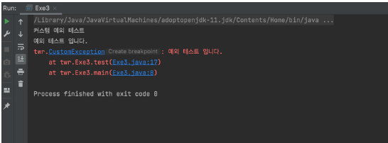
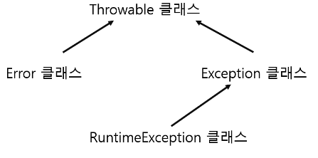

### 자바란?

---

- 객체 지향적 프로그래밍 언어
- 가전제품 내에 탑재해 동작하는 프로그램을 위해 개발했지만, 현재 웹 애플리케이션 개발에 가장 많이 사용하는 언어 중 하나

__왜 자바인가?__

- 20년 동안 프로그래밍 언어 1,2위를 유지하며 풍부한 커뮤니티와 다양한 코드존재 > 풍부한 학습자료
- 모던 프로그래밍 언어(객체지향 + 함수형)

__자바의 역사__

- 1995년 개발 1996년 공식 발표
- 1998 자바2버전
- 2004 자바5버전

### 자바의 특징

---

- 객체지향 프로그래밍 언어
- 단순하다
  - 포인터연산이 없다 ( 메모리상의 임의의 주소에 액세스 할 수 있는 기능)
  - 구조체를 사용하지 않는다
  - 타입선언을 하지 않는다
  - 전처리를 사용하지 않는다
  - 다중 상속을 허용하지 않는다(다만 인터페이스라는 개념으로 지원함)
  - String클래스를 제공한다.
  - 메모리 할당과 회수 시스템을 제공한다.(사용하지 않는 메모리는 GC가 자동을 사용을 해제)
  - 예외처리 기능을 제공한다.
- 네트워크 기반이다.
  - 네트워킹을 위해서 필요한 다양한 라이브러리를 제공하기 때문에 네트워크 프로그래밍을 훨씬 더 쉽게 작성 할 수 있다.
- 견고하다
  - 캐스트 연산자를 사용하지 않는 묵시적 형변환은 컴파일시 에러처리, 데이터의 범위를 벗어 날경우 에러처리
  - 이처럼 매우 엄격한 규칙을 요구하기에 실행시 에러를 발생하지 않는 견고한 소프트웨어 작성 가능
- 안전하다
  - 분산 네트워크 환경에서 사용되는 것을 전제로 만들어졌으므로, 데이터에 대한 액세스를 제한하기 위해 공용키 암호화 기법을 포함함
  - 불법적인 메모리 엑세스를 방지하기 위해 포인터 연산을 제공하지 않음
- 아키텍쳐로부터 독립적이다
  - 컴파일 시 이진 코드 대신 바이트 코드를 생성한다, 따라서 인터넷 등 네트워크에 연결된 다양한 종류의 플랫폼을 모두 수용하는 애플리케이션 구현이 가능하다.
- 다중 쓰레드
  - 하나의 쓰레드(하나의 커다란 프로세스 내에서 독립적으로 수행가능한 작은 프로세스)가 다른 여러 개의 쓰레드를 생성하여 데이터을 공유하면서 개별적인 작업을 수행할 수 있도록 하는 다중 쓰레드를 지원한다. 
  - 다중 사용자를 위한 프로그램을 개발할 때 서버의 부담을 경감시키는 효율적인 프로그램의 개발 가능
- 동적 결합
  - 종속적인 객체에 영향을 미치지 않으면서 부모 클래스의 메소드나 변수를 수정 혹은 추가할 수 있다.


### 자바 조건문 및 반복문

---

- if문

```java
if(조건식){조건식이 참일 때 동작하는 실행문}
```

- else문

```java
if(조건식){조건식이 참일 때 동작하는 실행문
       } else {위의 조건식이 거짓일 떄 동작하는 실행문}
```

- else if 문

```java
if(조건식1){조건식1이 참일 때 동작하는 실행문
       } else if(조건식2) {조건식1이 거짓이고 조건식2가 참일 때 동작하는 실행문
       } else {위의 두 조건식이 모두 거짓일때 동작하는 실행문}
```

- switch문
  - 전부 if문으로 대체할수 있음
  - 비교하고자하는 조건이 많을 경우 가독성이 높아지는 장점이 존재

```java
switch(변수) {
        case 값(변수와 값이 일치하면 해당 case의 실행문을 작동)
            실행문;
            break;(break을 안적어주면 아래로 가면서 전부 다 실행)
        degault:(변수와 값이 일치하는 케이스가 없으면 default의 실행문이 동작)
        	실행문;
        	break;
}
```

- for문
  - for(초기화;조건;증감)

```java
for(int i; i < 6; i ++) {
    System.out.println(i)
}
```

```
0
1
2
3
4
5
```

- 향상된 for문
  - jdk1.5이상에서 사용가능
  - 사용할 변수는 지역변수로 인식된다
  - 대상은 배열이나 여러 원소를 포함한 자료형이여야한다.
  - 대상 수정 불가
  - for(대입받을 변수정의:대상)

```java
Int[] arr = {1,2,3,4,5}
for(num:arr){
    System.out.println(num)
}
```

```
1
2
3
4
5
```

- while문

```java
while(조건식) {
    조건식이 참일 경우 실행 거짓이되면 종료
}
```

- do~while문
  - while문과 다르게 실행문을 무조건 한번은 실행하고 조건검사를 하여 반복을 결정함

```java
do {
    실행문;
} while (조건식)
```

- while문과의 비교

```
int i = 1
while(i<1){
	i++;
	System.ount.println(i);
}

int a = 1
do{
	a++;
    System.ount.println(a);
} while(a < 1)
```

```
while문 일때
실행 x

do~while문 일때
2
```


### JAVA생성자

- new 연산자를 통해서 인스턴스를 생성할 떄 반드시 호출이 되고 제일 먼저 실행되는 일종의 메소드
- 반드시 클래스명과 동일하게 작성해야함
- 반환값이 없음(리턴타입을 정의하지 않는다)
- 인스턴스 변수를 초기화 시키는 역할을 함
- 생성자를 생략하면 컴파일러가 자동적으로 기본 생성자를 생성함
- 사용자가 정의한 생성자가 있다면 기본생성자를 자동으로 생성하지 않음
- 생성자의 매개변수를 다르게 지정하여 정의하는 것을 생성자 오버로딩이라함

``` java
public class 클래스명{
    int age;
    //기본생성자
    public 클래스명(){}
    //매개변수를 넣은 생성자
    public 클래스명(int age){
        this.age = age   //인스턴스 초기화
    }
}
```

### 인터페이스

- 인터페이스의 역할

  - 인터페이스는 객체를 어떻게 구성해야 하는지 정리한 설계도	
  - 인터페이스는 객체의 교환성(또는 다형성)을 높여줌
  - 인터페이스 변수에 인터페이스가 구현된 서로 다른 구현 객체를 할당해서 사용이 가능

  - 구현 객체를 직접 몰라도 인터페이스 메서드만 알아도 객체 호출이 가능.

  - 객체가 인터페이스를 사용하면, 인터페이스 메서드를 반드시 구현해야 하는 제약

- 인터페이스의 구성요소

  - __상수 필드__
    - [public static final]는 명시적으로 사용하지 않아도, Compile Time에 자동으로 선언되어 상수로 만듬

  ```java
  public interface User {
      // 상수 필드
      [public static final] 필드타입 상수명 = 값;
      // 예시
      String FIRST_NAME = "lee"; 
      public static final String FIRST_NAME = "kunhee"; 
  }
  ```

  - 추상 메서드
    - 리턴 타입 / 메서드 이름 / 매개변수 가 기술되는 클래스 설계 메서드
    - 인터페이스 변수로 호출된 메서드는 최종적으로 구현 객체에서 실행. 그래서 실체는 인터페이스에 없고, 구현 클래스에 있음
    - [public abstract]은 명시적으로 선언하지 않아도, Compile Time에 자동으로 선언

  ```java
  public interface User {
      // 추상 메서드
      [public abstract] 리턴타입 메서드이름(매개변수);
      // 예시
      String sendMoney(Money money); 
      public abstract String sendMoney(Money money); 
  }
  ```

  - 디폴트 메서드
    - Java 8에서 추가
    - 클래스의 인스턴스 메서드와 동일, 다만 인터페이스에서 선언할 때, 리턴 타입 앞에 default 키워드가 붙음
    - [public]은 명시적으로 사용하지 않아도, Compile Time에 자동 선언
    - 오바라이드를 통해 구현클래스에서 재정의된 인스턴스 메서드로 사용도 가능

  ```java
  public interface User {
      // 디폴트 메서드
      [public] default 리턴타입 메서드이름(매개변수) { }
  }
  ```

  - 정적 메서드
    - Java 8에서 추가
    - [public]은 명시적으로 사용하지 않아도, Compile Time에 자동으로 선언
    - 클래스의 정적 메서드와 똑같은 방식으로 사용 가능

  ```java
  public interface User {
      // 정적 메서드(Static Method)
      [public] static 리턴타입 메서드이름(매개변수) { }
  }
  ```

- __인터페이스 구현__

  - 단일 인터페이스 구현 클래스
    - 하나라도 추상 메서드가 구현되지 않으면, 구현 클래스는 추상 클래스로 선언되어야 함

  ```java
  public class 구현클래스이름 implements 인터페이스이름 {
      // 인터페이스의 추상 메서드를 구현한 실체 메서드를 선언
  }
  ```

  - 다중 인터페이스 구현 클래스
    - 하나라도 추상 메서드가 구현되지 않으면, 구현 클래스는 추상 클래스로 선언되어야 함

  ```java
  public class 구현클래스이름 implements 인터페이스이름1, 인터페이스이름2 {
      // 인터페이스의 추상 메서드를 구현한 실체 메서드를 선언
  }
  ```

  - 익명 구현 객체
    - 일회성으로 사용하는 구현 클래스는 클래스로 만들어서 선언해서 쓰는 것이 비효율적
    - 임시 작업 스레드를 만들기 위해 많이 활용
    - new 키워드 뒤에 원래는 인터페이스 구현 클래스 이름이 와야 하는데, 익명 구현 객체의 경우에는 참조할 구현 클래스가 없기 때문에 User 인터페이스 이름을 그대로 사용
    - 익명 구현 객체를 사용한다고 해서, 클래스가 생성되지 않는 것은 아님
    - 익명 구현 객체가 사용된 자바 파일을 컴파일을 하게 되면 자동으로 익명 구현 객체의 클래스 파일이 생성

  ```java
  // 인터페이스에 선언된 추상 메서드의 실체 메서드 선언
  User user = new User() {
      public String sendMoney(Money money) {
          thirdpartyApi.send(money.getType(), money.getAmount());
          return Status.SUCCESS.name();
      }
  
      @Override
      public default void setStatus(Status status) {
          if(status == Status.ACTIVE) {
              System.out.println("수취인이 활성화 되었습니다");
              return;
          }
          System.out.println("수취인이 비활성화 되었습니다");
      }
  };
  ```


### 에외처리

- Exception
  - 사용자의 잘못된 조작 또는 개발자의 잘못된 코딩으로 인해 발생하는 프로그램 오류
  - 종류
    - 일반예외(Exception)
      - 컴파일시 발생하는 예외(checked Exception)
      - 무조건 예외처리를 해주어야 함
      - 프로그램 작성시 이미 예측가능한 예외
    - 실행예외(Runtiome Exception)
      - 컴파일 과정에서 예외코드를 검사하지 않음
      - 실행시 발생하는 예외(Unchecked Exception)
      - NullPointerException
        - 해당 객체가 null인 상태에서의 접근을 했을 때 발생
      - ArrayIndexOutOfBoundsException
        - 배열에서 할당된 인덱스 범위를 초과해서 사용할 경우 발생
      - NumberFormatException
        - 숫자로 변환할 수 없는 문자를 변환하려 할 때 발생
      - ClassCastException
        - 자식끼리 타입변환시키려고할 때 자주 발생( ex:차의 자식인 소방차, 승합차를 서로 타입변환시킨다)

- try,catch문
  - try문 안의 문장 수행 중 예외가 발생하게되면 catch문 안의 문장이 수행된다.

```java
try {
    ...
} catch(예외1) {
    ...
} catch(예외2) {
    ...
...
}
```

- finnally
  - try문장 수행 중 예외발생 여부에 상관없이 무조건 실행됨

```java
try {
    ...
} catch(예외) {
    ...
}finally{
    ...(try구문에서 예외가 나든 안나든 실행되는 문장)
}
```

- throws
  - 예외던지기 라고 한다.
  - 메소드가 작성된곳이 아니라 실제 실행 되는곳에서 처리하고 싶을 때 사용
  - 사용이유 (트랜잭션)

```java

//아래의 경우 각 메서드에서 예외처리를 하기에 하나의 메서드에서 예외가 일어나더라도 나머지 메서드가 실행되어 버린다.
상품발송() {
    포장();
    영수증발행();
    발송();
}

포장(){
    try {
       ...
    }catch(예외) {
       포장취소();
    }
}

영수증발행() {
    try {
       ...
    }catch(예외) {
       영수증발행취소();
    }
}

발송() {
    try {
       ...
    }catch(예외) {
       발송취소();
    }
}

//이렇게 될경우 아래의 메서드들에서 각각의 예외를 위로 던지기 때문에 하나라도 예외 발생시 상품발송이라는 트랜잭션을 취소할수 있다.

상품발송() {
    try {
        포장();
        영수증발행();
        발송();
    }catch(예외) {
        모두취소();  // 하나라도 실패하면 모두 취소한다.
    }
}

포장() throws 예외 {
   ...
}

영수증발행() throws 예외 {
   ...
}

발송() throws 예외 {
   ...
}
```

- Custom Exception

  - 장점
    - 예외클래스의 이름만으로 어떤 예외인지 알아보기 쉽다
    - 상세한 예외 정보를 제공할 수 있다.
    - 예외에 대한 응집도가 향상된다.
      - 사용자 정의 예외를 사용한다면 예외에 필요한 메시지, 전달할 정보의 데이터, 데이터 가공 메소드들을 한 곳에서 관리 가능
    - 예외 발생 후처리가 용이하다
  - 사용법
    - 사용자 정의 예외 클래스 작성 시 생성자는 두 개를 선언하는 것이 일반적
      - 매개 변수가 없는 기본 생성자
      - 예외 발생 원인(예외 메시지)을 전달하기 위해 String 타입의 매개변수를 갖는 생성자
    - 예외 메시지의 용도는 catch {} 블록의 예외처리 코드에서 이용하기 위해서

  ```java
  public class CustomException extends RuntimeException {
  
      // 1. 매개 변수가 없는 기본 생성자
      CustomException() {
      }
  
      // 2. 예외 발생 원인(예외 메시지)을 전달하기 위해 String 타입의 매개변수를 갖는 생성자
      CustomException(String message) {
          super(message); // RuntimeException 클래스의 생성자를 호출
      }
  }
  
  
  public static void main(String[] args) {
  
      try{
          test();
      } catch (CustomException e) {
          System.out.println("커스텀 예외 테스트");
          System.out.println(e.getMessage());
          e.printStackTrace();
      }
  }
  
  public static void test() throws CustomException {
      throw new CustomException("예외 테스트 입니다."); //throw는 예외 강제발생
  }
  
  ```

  실행결과

  


- throwable
  - 예외 클래스의 최상위 클래스
  - 자주 쓰이는 메서드
    - getMessage()
      - String 타입의 매개변수 메시지를 갖는 생성자를 이용하였다면, 메시지는 자동적으로 예외 객체 내부에 저장되게 되는데 이 메시지를 리턴하는 함수.
    - printStackTrace()
      - 예외 발생 코드를 추적해서 모두 콘솔에 출력
      - 어떤 예외가 어디에서 발생했는지 상세하게 출력해주기 때문에 프로그램을 테스트하면서 오류를 찾을 때 활용




### SOLID(객체지향 설계)

- __S__ (SRP, Single responsibility principle)

  - 단일 책임 원칙 
  - 한 클래스는 하나의 책임만을 가진다.
  - 객체지향에 있어서 책임이란 객체가 **할 수 있는 것** 과 **해야 하는 것** 으로 나뉘어져 있다. 즉 한 마디로 요약하자면 하나의 객체는 자신이 할 수 있는 것과 해야하는 것만 수행 할 수 있도록 설계되어야 한다는 법칙

- __O__(OCP, Open-Closed Principle)

  - 개방-폐쇄 원칙
    - 기존의 코드를 변경하지 않으면서 기능을 추가할 수 있도록 설계되어야 함

- __L__(LSP, Liskov Substitution Principle)

  - 리스코프 치환원칙
  - 자식 클래스는 최소한 자신의 부모 클래스에서 가능한 행위를 수행할 수 있어야 한다
  -  LSP를 만족하면 프로그램에서 부모 클래스의 인스턴스 대신에 자식 클래스의 인스턴스로 대체해도 프로그램의 의미는 변화되지 않음
  -  서브 클래스가 슈퍼 클래스의 책임을 무시하거나 재정의 하지 않고 확장만 수행

- __I__(ISP,Interface Segregation Principle )

  - 인터페이스 분리 원칙
  - 클라이언트에서는 클라이언트 자신이 이용하지 않는 기능에는 영향을 받지 않아야 한다

- __D__(DIP, Dependency Inversion Principle)

  - 의존 역전 원칙
  - 변화하기 쉬운 것 또는 자주 변화하는 것보다는 변화하기 어려운 것, 거의 변화가 없는 것에 의존하라

  
