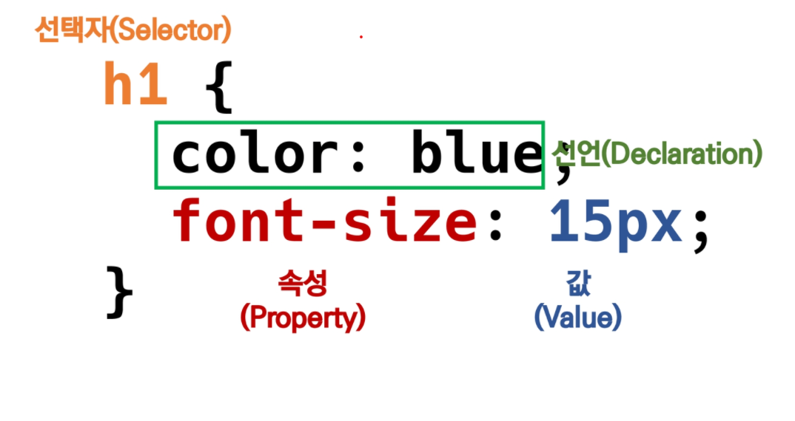

# Web

### HTML

- Hyper Text Markup Language

- 기본구조

  - `html` 문서의 최상위(root) 요소

    ---

  - `head` 문서 메타데이터 요소

    - 문서제목,인코딩,스타일,외부 파일 로딩 등
    - 일반적으로 브라우저에 나타나지 않는 내용

  - head 예시

    - `<title>` 브라우저 상단 타이틀
    - `<meta>` 문서 레벨 메타데이터 요소
    - `<link>` 외부리소스 연결 요소
    - `<script>` 스크립트 요소
    - `<style>` CSS 직접 작성

    ---

  - `body` 문서 본문요소

    - 실제 화면 구성과 관련된 내용

    ---

  - 속성

    - 속성을 통해 태그의 부가적인 정보를 설정
    - 요소는 속성을 가질 수 있음
    - 시작 태그에 작성
    - 이름과 값이 하나의 쌍으로 존재

  - HTML Global Attribute

    - 모든 HTML 요소가 공통으로 사용할 수 있는 대표적인 속성 (몇 요소에는 효과 x)
    - `id` 문서 전체에서 유일한 고유 식별자 지정
    - `class` 공백으로 구분된 해당 요소의 클래스 목록
    - `data-*` 페이지에 개인 사용자 정의 데이터를 저장
    - `style` inline 스타일
    - `title` 요소에 대한 추가 정보 지정
    - `tabindex` 요소의 탭 순서

    ---

  - 시맨틱 태그

    - 의미론적 요소를 담은 태그
    - 요소의 의미가 명확해지기 때문에 코드의 가독성을 높이고 유지보수를 쉽게 함
    - `header` 문서 전체나 섹션의 헤더
    - `nav` 내비게이션
    - `aside` 사이드에 위치한 공간
    - `section` 문서의 일반적인 구분, 컨텐츠의 그룹을 표현
    - ` article` 문서,페이지,사이트 안에서 독립적으로 구분되는 영역
    - `footer` 문서 전체나 섹션의 마지막 부분

    ---

  - 텍스트 요소

    - `<a></a>`href 속성을 활용하여 다른 URL로 연셜하는 하이퍼링크 생성
    - `<b></b>` 굵은 글씨 요소
    - `<i></i>` 기울임 글씨요소
    - `<strong></strong><em></em>` 굵은 글씨와 기울임 글씨요소임은 위와 동일
      그러나 태그자체에 중요하다는 뜻이 있음으로 시맨틱 태그
    - `<br>` 텍스트 내에 줄 바꿈 생성
    - `` src속성을 활용하여 이미지 표현
    - `<span></span>` 의미 없는 인라인 컨테이너

    ---

  - 그룹 컨텐츠

    - `<p></p>` 하나의 문단
    - `<hr>` 문단 레벨 요소에서의 주제의 분리를 의미 수평선으로 표현
    - `<ol></ol>` 순서가 있는 리스트
    - `<ul></ul>` 순서가 없는 리스트
    - `<pre></pre>` HTML에 작성한 내용을 그대로 표현 공백문자 유지해줌
    - `<blockquote></blockquote>`텍스트가 긴 인용문 주로 들여쓰기 한것으로 표현
    - `<div></div>` 의미 없는 블록 레벨 컨테이너

    ---

  - table

    - 각 영역을 명시하기 위해 `<thead>` `<tbody>` `<tfoot>` 요소를 활용

    - `<tr>`로 가로 줄을 구성 내부에는 `<th>` 혹은 `<td>`로 셀을 구성

    - `colspan, rowspan` 속성을 활용하여 셀 병합

    - `<caption>`을 통해 표 설명 또는 제목을 나타냄

      

  ---

  - form
    - 정보를 서버에 제출하기 위한 영역
  - `<form>`의 기본 속성
    - action: form을 처리할 서버의 URL
    - method: form을 제출할 때 사용할 HTTP 메서드
    - enxtype: method가 post인 경우 데이터의 유형

  ---

  - input
    - 다양한 타입을 가지는 입력 데이터 유형과 위젯이 제공
  - `<input>` 대표적인 속성
    - name: form control에 적용되는 이름(이름/값 페아로 전송)
    - value: form control에 적용되는 값(이름/값 페어로 전송)
  - input label
    - label을 클릭하여 input 자체의 초점을 맞추거나 활성화 가능
    - `<input>`에 id속성을 `<label>`에는 for 속성을 활용하여 상호 연관 시킴
  - input 유형(너무 많다 외우거나 필요할 때 구글링하자)
    - text, password, email, number, file, checkbox, radio, color picker, date picker, hidden

---

### CSS

- Cascading Stlye Sheet: 스타일을 지정하기 위한 언어

- CSS 구문

  

  - 선택자를 통해 스타일을 지정할 HTML 요소 선택
  - 중괄호 안에는 속성과 값 하나의 쌍으로 이루어진 선언을 진행
  - 각 쌍은 선택한 요소의 속성, 속성에 부여할 값을 의미
    - 속성:어떤 스타일 기능을 변경할지 결정
    - 값 : 어떻게 스타일 기능을 변경할지 결정

- CSS 정의 방법

  - 인라인
  - 내부 참조 `<style>`
  - 외부 참조
    - 분리된 CSS 파일 `<head>`내`<link>`를 통해 불러오기

---

- 선택자 유형

  - 기본 선택자
    - 전체 선택자(`*`), 요소 선택자, 클래스 선택자(`.`), id 선택자(`#`)
  - 결합자
    - 자손 결합자(띄어쓰기), 자식 결합자(`>`), 일반 형제 결합자(`~`), 인접 형제 결합자(`+`)

- CSS적용 우선순위

  1.중요도-사용시 주의( 그냥 안쓰는게 좋음)

  - `!important`

  2.우선 순위

  - 인라인 > id > class, 속성, pseudo-cass > 요소, pseudo-element

  3.CSS 파일 로딩 순서

---

- CSS 상속
  - CSS는 상속을 통해 부모 요소의 속성을 자식에게 상속
  - 상속 되는 것 예시
    - Text 관련 요소
  - 상속 되지 않는 것 예시
    - Box model 관련 요소
    - position 관련 요소

---

- CSS 기본 스타일
  - 크기단위
    - `px`, `%`, `em`, `rem`, `viewport`
  - 색상 단위  (`a`는 투명도)
    - 색상 키워드 - 대소문자를 구분하지 않음 rEd 가능
    - RGB 색상 - 16진수 표기번 혹은 함수령 표기법을 사용, 특정 색 표현
    - HSL 색상 - 색상, 채도 ,명도를 통해 특정 색을 표현(page122)

---

- Box model
  - 모든 요소는 네모(박스모델)이고, 위에서부터 아래로, 왼쪽에서 오른쪽으로 쌓인다.
  - 하나의 박스는 다음 네 부분으로 이루어짐
    - content, padding, border, margin
  - margin
    - 10px(상하좌우)
    - 10px 20px(상하10 좌우 20)
    - 10px 20px 30px(상10 중20 하30)
    - 10px 20px 30px 40px(상10우20하30좌40(시계방향))
  - box-sizing
    - 기본적으로 모든 요소의 box-sizing은 content-box
    - Padding을 제외한 순수 contents 영역만을 box로 지정
    - box-sizing을 border-sizing으로 지정하면 편함

---

- CSS Display
  - `display: block`  
    - 줄바꿈이 일어나는 요소
    - 화면 크기 전체의 가로 폭을 차지
    - 블로 요소안에 인라인 요소 들어갈 수 있음
  - `dispaly: inline` 줄바꿈이 일어나지 않는 행의 일부 요소
    - content너비만큼 가로폭을 차지
    - 상하여백은 `line-height`로 지정한다.
    - 원래 인라인 요소는 width,height이런거 못하지만 img는 가능

---

- CSS position
  - 문서 상에서 요소의 위치를 지정
  - static: 모든 태그의 기본 값
  - relative, absolute, fixed를 통해서 이동 가능
  - `relative`
    - 상대위치
    - 자기자신의 static위치를 기준으로 이동 (이동후 공간 여전히 차지)
  - `absolute` 
    - 절대 위치
    - static이 아닌 가장 가까이 있는 부모/조상 요소를 기준으로 이동(없는 경우 body)
    - 이동 후 공간 차지 없음
  - `fixed` 
    - 고정위치
    - 요소를 일반적인 문서흐름에서 제거 후 레이아웃에 공간 차지 x
    - viewport기준으로 이동(스크롤 시에도 항상 같은 곳에 위치)

---

### CSS Layout

- __Float__

  - 박스를 왼쪽 혹은 오른쪽으로 이동시켜 텍스트를 포함 인라인요소들이 주변을 wrarpping 하도록 함
  - 요소가 Normal flow를 벗어나도록 함

- Float 속성

  - `none` 기본값
  - `left` 요소를 왼쪽으로 띄움
  - `right` 요소를 오른쪽으로 띄움

- clearfix

  - float 요소의 부모로 div를 주고 부모에게 .clearfix

    ```htm
    .clearfix :: after {			
    	content:"";
    	display: block;
    	clear:both;
    }
    ```

- __Flexible Box Layout__

  - 행과 열 형태로 아이템들을 배치하는 1차원 레이아웃 모델

  - (수동 값 부여 없이) 수직정렬 가능

  - 아이템의 너비와 높이 혹은 간격을 동일하게 배치

  - 축

    - main axis (메인 축)
    - cross axis (교차 축)

  - 구성 요소

    - Flex Container (부모요소)
      - flexbox 레이아웃을 형성하는 가장 기본적인 모델
      - display속성을 flex로 지정
    - Flex Item (자식 요소)

  - flex-direction

    - 메인 축 기준 방향 설정

    

  - flex-wrap

    - 아이템이 컨테이너를 벗어나는 경우 해당 영역 내에 배치되도록 설정

      

  - flex-flow
  
    - direction과 wrap의 숏핸드
  
  - justify-content
  
    - 메인 축 기준으로 공간 배분
  
    
  
  - align-items
  
    - 크로스 축 기준으로 정렬
  
    
  
  - align-self
  
    - 개별 아이템에 크로스 축 기준으로 정렬
  
  - 기타속성
  
    - flex-grow: 남은 영역을 아이템에 분배
    - flex-order: 배치 순서 (0이 최우선 순위임)

---

### Bootstrap

- spacing

  

- Grid system

  - container(필수 아님 양쪽 공간 이쁘라고 하는거)
  - row (부모 박스 필수)
  - col (자식 박스 부모 박스에서 얼마나 크기를 차지 할지 결정)


