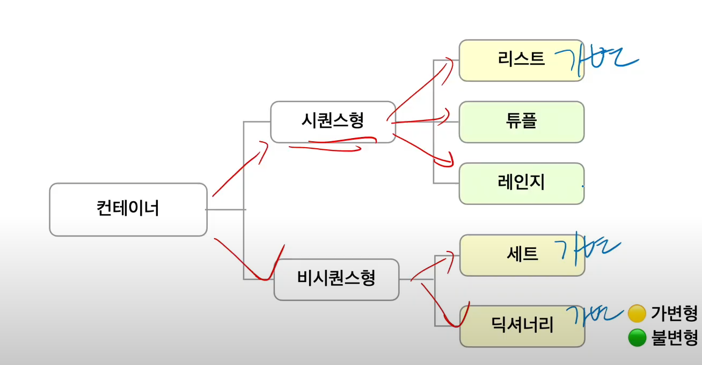
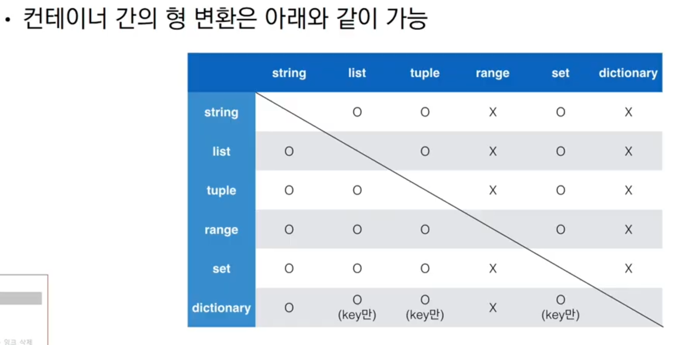
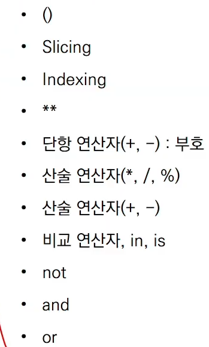
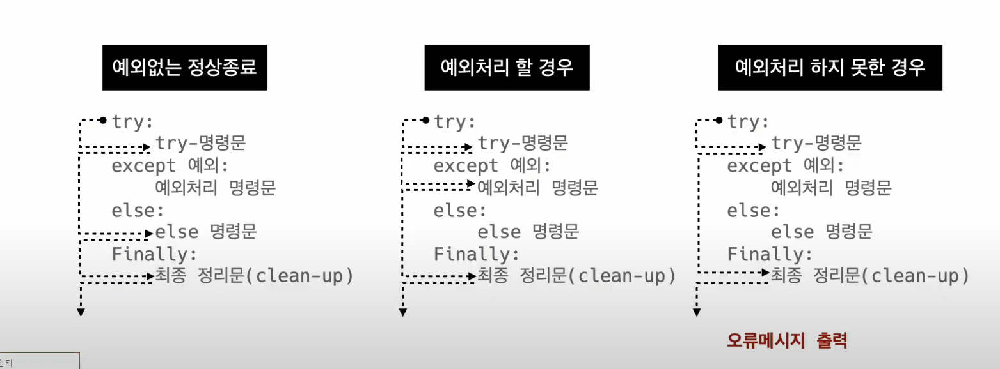
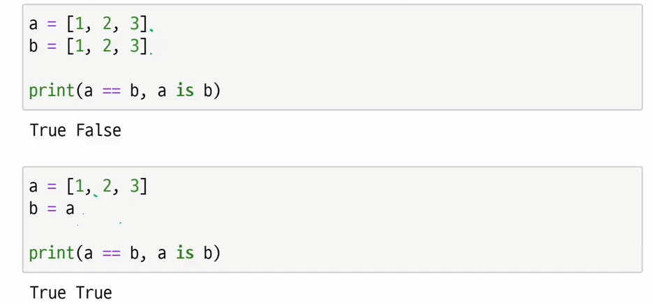
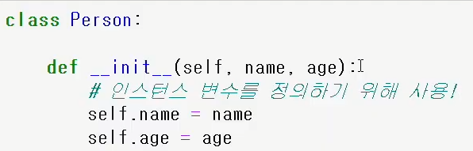
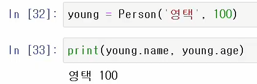
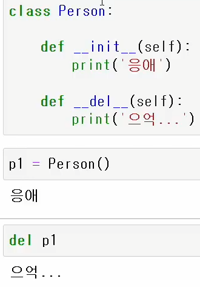

### 들여쓰기

---

- 들여쓰기 할 때 스페이스 4번 or tap키 1번


### 변수

- 컴퓨터 메모리 어딘가에 저장되어 있는 객체를 참조하기 위해 사용되는 이름

- `=` : 같다는 뜻이 아니라 오른쪽의 결과를 왼쪽에 할당한다라는 뜻

- 객체: 숫자,문자,클래스 등 값을 가지고 있는 모든 것(=things, ~것) 

---

__변수 할당__

- 같은 값을 동시에 할당 가능
- 다른 값을 동시에 할당 가능


### 식별자

---

- 파이썬 객체를 식별하는데 사용하는 이름
- 규칙
  - 식별자의 이름은 영문 알파벳, 언더스코어,숫자로 구성
  - 첫 글자에 숫자 불가능
  - 길이제한 없고, 대소문자 구별
  - 내장함수나 모듈 등의 이름으로도 만들면 안됨


### 자료형

---

1. none타입
2. 불린


### 수치형

---

- 정수(imt)
  - 진수표현
    - 2진수:0b10 = 2
    - 8진수:0o30 = 24
    - 16진수:0x10 = 16

- 실수(float)
  - 실수 값 비교 과정에서 floating point rounding error발생 가능

- 복소수(complex)


### 문자열

---

__문자열(string type)__

- 모든 문자는 str타입
- 문자열은 작은 따옴표 `'` 나 큰 따옴표 `"` 를 활용하여 표기
  - 문자열 묶을 때 항상 동일한 문장부호 활용

__string interpolation__

- %-formatting
- str.format()
- f-strings: python3.6+


### 컨테이너

---

- 여러개의 값을 담을 수 있는 것(객체)으로 서로 다른 자료형을 저장 할수 있음
- 컨테이너의 분류
  - 순서가 있는 데이터(시퀀스형) vs 순서가 없는 데이터(비시퀀스형)




__리스트__

- 순서를 가지는 0개 이상의 객체를 참조하는 자료형
- 생성된 이후 내용 변경이 가능 > __가변자료형__

- `[]`나 `list()`로 생성


__튜플__

- 순서를 가지는 0개 이상의 객체를 참조하는 자료형
- 생성 후, 담고있는 객체 변경이 불가 > __불변 자료형__
- `()` 혹은 `tuple()`을 통해 생성
- 튜플은 수정 불가능한 시퀀스로 인덱스로 접근 가능
- 단일 항목의 경우
  - 하나의 항목으로 구성된 튜플은 생성 시 값 뒤에 쉼표를 붙여야 함 ( a=1,  이렇게)
- 복수 항목의 경우
  - 마지막 항목 뒤에 쉼표 안붙여도 됨

__튜플 대입__

- 우변의 값을 좌변의 변수에 한번에 할당하는 과정


__레인지__

- 숫자의 시퀀스를 나타내기 위해 사용
  - 기본형: range(n)
    - 0부터 n-1까지의 숫자 시퀀스
  - 범위 지정: range(n,m)
    - n부터 m-1까지의 숫자 시퀀스
  - __범위 및 스텝 지정 : ramge(n,m,s) __
    - n부터 m-1까지 s만큼 증가시키며 숫자의 시퀀스    


__셋(set)__

- 순서없이 0개 이상의 해시 가능한 객체를 참조하는 자료형
- 담고있는 객체를 삽입, 변경, 삭제 가능 >__가변자료형__
  - 수학의 집합과 비슷

- 중복없이 순서가 없는 자료구조
- `{}` 혹은 set()`으로 생성
- 순서가 없어 별도의 값에 접근할 수 없음 (인덱스 접근 불가)
- 빈 set을 만들 때는 `set()`을 무조건 사용
- 활용 시 중복된 값을 쉽게 제거 가능


__딕셔너리__

- 순서 없이 키-값 쌍으로 이뤄진 객체를 참조하는 자료형
- 키: 해시가능한 불변 자료형만 가능(변경 불가능한 데이터)
- 각 키의 값: 어떠한 형태든 관계없음
- `{}` 혹은 `dict()`로 생성


### 형 변환

---

- 암시적 형 변환
  - 사용자가 의도하지 않고 파이썬 내부적으로 자료형을 변환

- 명시적 형 변환

  - 사용자가 특정 함수를 활용하여 의도적으로 자료형을 변환 

  - str은 정수형식 일때만 int 가능

  - str이 정수라도 float 가능

    


### 연산자

---

__산술 연산자__

- `//`  : 몫
- `%`  :  나머지
- `**` : 거듭제곱

__비교 연산자__

- `==` : 같음
- `!=` : 같지 않음

__논리 연산자__

- 결과가 확실한 경우 두 번째 값은 확인하지 않음
  - and 연산에서 첫번쨰 값이 false인 경우 무조건 false >첫번째 값 반환
  - or 연산에서 첫번째 값이 true인 경우 무조건 true >첫번째 값 반환

- `AND`
- `OR`

- `NOT`

__복합 연산자__

- 연산과 대입이 함께 이루어짐

__식별 연산자__

- `is` 연산자를 통해 동일한 객체인지 확인

__멤버십 연산자__

- 포함 여부 확인
  - `in`
  - `not in`

__시퀀스형 연산자__

- 산술연산자(+)
  - 시퀀스 간의 연결
- 반복연산자(*)
  - 시퀀스를 반복

__기타: 인덱싱__

- 시퀀스의 특정 인덱스 값에 접근
  - 해당 인덱스가 없는 경우 `IndexError`

```python
[1,2,3][2]
3
```

__기타:슬라이싱__

- 시퀀스를 특정 단위로 슬라이싱

__기타:set연산자__

- `|`: 합집합
- `&` :교집합

- 연산자 우선 순위




### 제어문

---

- 위에서부터 아래로 순차적으로 명령을 수행
- 조건문은 참/거짓을 판단할 수 있는 조건식과 함께 사용

  

__조건 표현식__

- <true인 경우 값> if <expression> else <false인 경우 값>


__반복문__

- while문
  - 조건식이 참인 경우 반복적으로 코드를 실행
  - 조건이 참인 경우 들여쓰기 되어 있는 코드 블록이 실행
  - while문은 무한 루프 하지 않도록 종료조건이 반드시 필요

- for문

  - 시퀀스를 포함한 순회가능한 객체 요소를 모두 순회함
  - 처음부터 끝까지 모두 순회화므로 별도의 종료조건이 필요하지않음
  - __딕셔너리 순회__
    - 딕셔너리는 기본적으로 key를 순회하며,key를 통해 값을 활용
    - keys():key로 구성된 결과
    - values(): value로 구성된 결과
    - items(): (key,value)의 튜플로 구성된 결과
  - __enumerate 순회__
    - 인덱스와 객체를 쌍으로 담은 열거형 객체 반환

  

# 함수

__함수의 정의__

- 특정한 기능을 하는 코드의 조각(묶움)
- 특정 명령을 수행하는 코드를 매번 다시 작성하지 않고, 필요시에만 호출하여 간편히 사용

__사용자 함수__

- 사용자가 직접 함수 작성
  - def funcion_name(parameter):

__선언과 호출__

- 함수는 함수명()으로 호출

__값에 따른 함수의 종류__

- Void functoin
  - 명시적인 return 값이 없는 경우, None을 반환하고 종료
- return은 함수 안에서만 사용되는 키워드
- print는 출력을 위해 사용되는 함수

__두 개 이상의 값 반환__

- return x,y 이렁식으로하면 튜플로 (x,y)반환 함

__함수의 입력__

- Parameter: 함수 실행할 깨, 함수 내부에서 사용되는 식별자
- Argument: 함수를 호출 할 때, 넣어주는 값
  - Argument란?
    - 함수 호출 시 함수의 파라미터를 통해 전달되는 값
    - 필수 Argument: 반드시 전달되어야 하는 argument
    - 선택 Argument: 값을 전달하지 않아도 되는 경우는 기본 값이 전달
    - 기본적으로 함수 호출 시 Argument는 위치에 따라 함수 내에 전달
    - 직접 변수의 이름으로 특정 Argument에 전달 가능

__함수의 범위__

- 함수는 코드 내부에 lacal scope를 생성하고, 그외의 공간은 global scope

__변수 수명주기__

- built-in scope
  - 파이썬이 실행된 이후부터 영원히
- global scope
  - 모듈이 호출된 시점 이후 혹은 인터프리터가 끝날 때까지 유지
- local scpoe
  - 함수가 호출되고 종료할때까지

__이름 검색 규칙__

- 아래와 같은 순서로 이름을 찾아 나가며 LEGB 룰이라고함
  - local
  - enclosed
  - global
  - built-in

__함수의 문서화__

- 좋은 함수와 parameter 이름을 짓는 방법
  - 상수 이름은 영문 전체를 대문자
  - 클래스 및 예외의 이름은 각 단어의 첫 글자만 영문 대문자
  - 이외 나머지는 소문자 또는 밑줄로 구분한 소문자 사용
  - 스스로를 설명
  - 약어 사용을 지양

__함수 응용__

- __map__

  - map(function, iterable)

  - 순회 가능한 데이터구조(iterable)의 모든 요소에 함수(function)적용하고,그 결과를

    map object로 반환

- __filter__

  - filter(fuction, iterable)

  - 순회 가능한 데이터구조(iterable)의 모든 요소에 함수(function)적용하고

    결과가 true인 것들만 filter object로 반환

- __zip__

  - zip(*iterables)
  - 복수의 iterble을 모아 튜플을 원소로 하는 zip object를 반환

- __lambda 함수__
  - lambda[parameter]:표현식
  - 표현식을 계산한 결과값을 반환
  - return 문을 가질 수 없음

- __재귀함수__
  - 자기 자신을 호출하는 함수
  - 무한한 호출을 목표로 하는 것이 아니며, 알고리즘 설계 및 구현에서 활용
  - 1개 이상의 base case(종료되는 상황)가 존재하고, 수렴하도록 작성
- __재귀 함수 주의 사항__
  - 매모리 스택이 넘치게 되면 프로그램이 동작하지 않게 됨
  - 파이썬에서는 최대 재귀 싶이는 1000번

# 모듈

- 모듈
  - 특정 기능을 하는 코드를 파이썬 파일(.py)단위로 작성한 것
- 패키지
  - 특정 기능과 관련된 여러 모듈의 집합
  - 패키지 안에는 또 다른 서브 패키지를 포함
- __모듈과 패키지 불러오기__
  - impiot module
  - form package import module

- [파이썬 표준 라이브러리](https://docs.python.org/ko/3/library/index.html)


# 데이터구조

 ### 메소드

1. __문자열__
   - `s.find(x)` x의 첫번쨰 위치를 반환/ 없으면, -1을 반환
   - `s.index(x)` x의 첫번째 위치를 반환/ 없으면, 오류 발생
   - `s.replace(old,new,[count])` 바꿀 대상 글자를 새로운 글자로 바꿔서 반환
   - `s.strip([chars])` 공백이나 특정 문자를 제거
   - `s.split(sep=None,maxsplit=-1)` 
   - `s.join([iterable])` 반복가능한 컨테이너 요소들을 sparator(구분자)로 합쳐 문자열 반환
2. __리스트__
   - `L.append(x)` 리스트 마지막에 항목x를 추가
   - `L.insert(i,x)` 리스트 인덱스 i에 항목x를 삽입
   - `L.remove(x)` 리스트 가장 왼쪽에 있는 항목x를 제거
   - `L.pop()` 리스트 가장 오른쪽에 있는 항목을 반환 후 제거
   - `L.pop(i)` 리스트의 인덱스i에 있는 항목을 반환 후 제거
   - `L.extend(iterable)` 리스트에 iterable의 항목을 추가함
   - `L.clear()`모든 항목을 삭제함
   - `L.index(x)` x값을 찾아 해당 index 값을 반환
   - `L.count(x)` 원하는 값의 개수를 반환함
   - `L.sort()` 원본 리스트를 정렬하고 None를 return
   - `L.reverse()` 순서를 반대로 뒤집음
3. __튜플__
   - 리스트 메서드 중 항목을 변경하는 메소드들을 제외하고 대부분 동일
4. __셋__
   - `s.add(x)` 항목 x가 셋s에 없다면 추가
   - `s.add()` 셋에 값을 추가
   - `s.update(*others)` 여러 값을 추가
   - `s.remove()` 셋에서 삭제하고 없으면 KeyError
   - `s.discard()` 셋에서 삭제하고 없어도 에러발생x
   - `s.pop()` 임의의 원소를 제거해 반환
5. __딕셔너리__
   - `.get(key)` key값을 통해value가져옴
   - `.pop(key[,degault])` key가 딕셔너리에 있으면 제거하고 해당값을 반환 디폴트값이 없으면 키에러
   - `.update()` 값을 제공하는 ket,value로 덮는다. 

### 얕은 복사와 깊은 복사

__같은 값이지만 아래에서 다르게 참조하고 싶을때__

1. __할당__
   - `대입 연산자(=)`
   - 리스트를 리스트로 형변환 하는식으로함
   - 리스트안에 리스트가 있다면 안됨
2. 깊은 복사
   - `copy.deepcopy() ` 리스트 안에 리스트가 있다면 쓰자

# 에러 예외처리

### 디버깅

- print함수 활용
  - 특정 함수 결과,반복/조건 결과 등 나눠서 생각,코드를 bisection으로 나눠서 생각
- 개발 환경에서 제공하는 기능 활용
- Python tutor 활용
- 뇌컴파일,눈디버깅

### 문법 에러

- __SyntaxError__:  `^`로 에러가 발생한 줄을 알려줌
  - __Invalid syntax__:유효하지 않는 문법이다
  - __assign to literal__
  - __EOL__: 문자열 따옴표 끝에 안씀
  - __EOF__: 괄호 연 후 안닫음

### 예외

- __ZeroDivisionError__: 0으로 나눔
-  __NameError__: 그 변수의 이름이 없음 
- __TypeError__: 타입 불일치, argument누락 등
- __ValueError__: 타입은 올바르나 값이 적절하지 않거나 없는 경우
- __IndexError__ : 인덱스가 존재하지 않거나 범위를 벗어나는 경우
- __KeyError__: 해당키가 존재하지 않음
- __ImportError__ : 모듈은 있으나 존재하지않는 클래스/함수를 가져오는경우


### 예외처리

- __try문/except절__



- __에러 메시지 처리(as)__

### 예외 발생 시키기

- __raise__
  - 실제 프로덕션 코드에서 사용

- __assert__
  - 일반적으로 디버깅에 사용


# OOP

### 객체

-객체는 특정 타입의 인스턴스 이다.

__객체의 특징__

- 타입:어떤 연산자와 조작이 가능한가?
- 속성:어떤 상태(데이터)를 가지는가?
- 조작접: 어떤 행위(함수)를 할 수 있는가?

### 객체지향 프로그래밍

- 프로그램을 여러 개의 독립된 객체들과 그 객체들 간의 상호작용으로 파악하는 프로그래밍 방법

### OOP 기본 문법

- 클래스 정의: 객체들의 분류
- 인스턴스 생성: 하나하나의 실체
- 메소드 호출: 특정 데이터타입/클래스의 객체에 공통적으로 적용 가능한 행위(함수)
- 속성:특정 데이터 타입/클래스의 객체들이 가지게 될 상태/데이터를 의미

__객체 비교하기__

- `==` 동등한 내용을 담고있니
- `is` 동일한 거니?



__인스턴스 변수__

- 인스턴스가 개인적으로 가지고 있는 속성
- 각 인스턴스들의 고유한 변수

__인스턴스 메소드__

- 인스턴스 변수를 사용하거나, 인스턴스 변수에 값을 설정하는 메소드
- 클래스 내부에 정의되는 메소드의 기본
- __호출시, 첫번째 인자로 인스턴스 자기자신(self)이 전달됨__

__self__

- 인스턴스 자기자신
- 인스턴스 메소드는 호출시 첫번째 인자로 인스턴스 자신이 전달되게 설계
- 다른 단어로 써도 되지만, 관습적으로 self쓰니까 바꿔쓰지말자

__생성자 메소드__

- 인스턴스 객체가 생성될 때 자동으로 호출되는 메소드
- 인스턴스 변수들의 초기값을 설정





__소멸자 메소드__

- 인스턴스 객체가 소멸되기 직전에 호출되는 메소드



__매직 메소드__

- 던더가 있는 메소드는 특수한 동작을 위해 만들어진 메소드
- 특정 상황에 자동으로 불리는 메소드

__클래스__

- 클래스 변수
  - 한 클래스의 모든 인스턴스라도 똑같은 값을 가지고 있는 속성
- 클래스 이름 대신 인스턴스 이름을 쓰면
  - 인스턴스 변수
- 클래스 선언 내부에서 정의

- 클래스 메소드는 @classmethod로 선언
- 스태틱 메소드
  - @staticmethod로 선언
  - 자동으로 인자로 넘겨주는거 없음

### 객체지향의 핵심 4가지

1. __추상화__
2. __상속__
   - 두 클래스 사이 부모-자식 관계를 정립하는것
   - 클래스는 상속이 가능함
   - 하위 클래스는 상위 클래스에 정의된 속성,행동,관계 및 제약 조건을 모두 상속 받음
   - 코드 재사용성이 높아진다.
3. __다형성__
   - 동일한 메소드가 클래스에 따라 다르게 행동할 수 있음을 의미
     - 상속 받은 메소드를 재정의
4. __캡슐화__
   - 객체의 일부 구현 내용에 대해 외부로부터의 직접적인 액세스를 차단
   - 파이썬에서 암묵적으로 존재하지만 , __언어적으로는 존재하지 않음__
   - 접근제어자
     - Public Access Modifier
       - 어디서나 호출가능
     - Protected Member Modifier
       - 언더바 1개로 시작하는 메소드나 속성
       - 암묵적 규칙에 의해 부모 클래스 내부와 자식 클래스 내부에서만 사용 가능
     - Private Member Modifier
       - 언더바 2개로 시작하는 메소드나 속성
       - 본 클래스 내부에서만 사용이 가능


