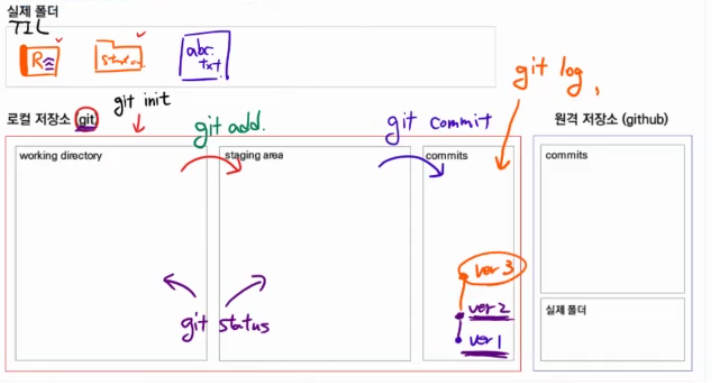

### git 

- (분산) 버전 관리 프로그램

---

__git init__ 깃으로 관리 시작

### 깃의 3가지 공간

- 작업공간( working directory)

   - git add를 통해 다음 파트

- staging area (확인,검수)

   - git commit를 통해 다음 파트

- local repository

   - git push를 통해서 remote repo에 올림
  - (git push -u origin master)

### 깃의 상태

__git status__ 깃 현상태 확인

__git branch__: 브랜치 목록 확인

__git branch 브랜치이름__: 새로운 브랜치 생성

__git branch-d 브랜치이름__: 특정 브랜치 삭제(병합된 브랜치만 삭제)

__git branch-D 브랜치이름__: 특정 강제 브랜치 삭제

__git switch 브랜치 이름__: 다른 브랜치로 이동

__git log --oneline --all --graph__ : 깃 전체의 가지 상황까지 확인

__git switch -c 브랜치 이름__: 브랜치 생성과 동시에 브랜치로 이동

__untracked__: 처음으로 관리되는 대상 

- 빨간색으로 표시됨 
- staging area에 올라가기전

__tracked__: 관리되고 있는 대상

- 처음관리되는 대상이면서 staging area에 올라가면 녹색으로 new file

- __modified__: 관리중인데 수정된 대상
- __unmodified__

### merge(병합)

__git merge 병합할 브랜치 이름__ 

- merge 하기 전에 일단 다른 브랜치를 합치려고 하는, 즉 메인 브랜치로 switch 해야 함

__1. fast-forward__

- 메인브랜치 변화없이 다른브랜치만 변화했을 때 병합하면 사실상 그냥 HEAD가 앞으로 간거랑 다를게 없음

__2. 3-way merge(merge commit)__

- 메인 브랜치도 변화하고 다른브랜치도 변화했을 때 두 브랜치가 갈라졌던 공통조상을 사용해서 머지를 진행함

__3. merge conflict__

- merge하는 두 브랜치에서 같은 파일의 같은 부분을 동시에 수정하고 merge하면, git은 해당 부분을 자동으로 merge해주지 못함
- 반면 동일 파일이더라도 서로 다른 부분을 수정했다면  conflict 없이 자동으로 merge commit 된다.

